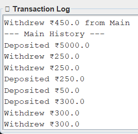
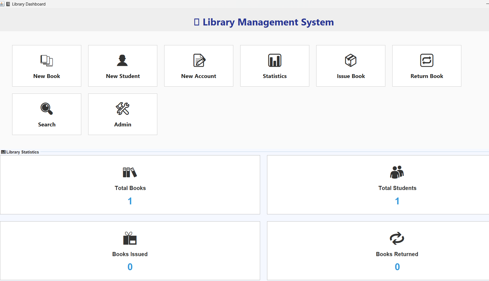
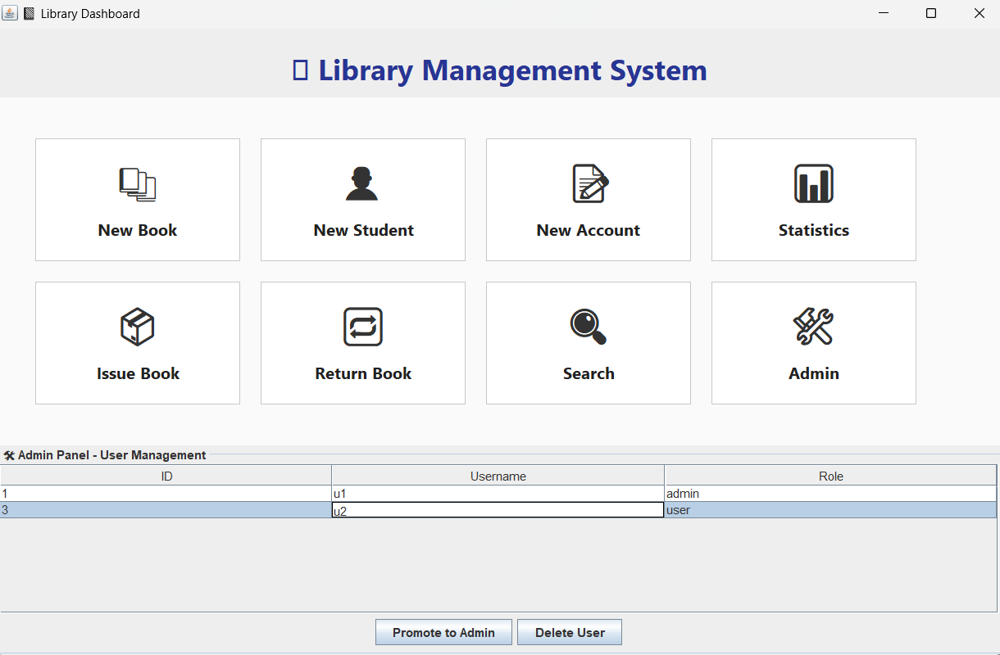

# 🚀 CANTILEVER: Java Programming Internship

Welcome to **CANTILEVER** — a portfolio of powerful full-stack Java projects including GUI applications, real-time systems, and database-driven interfaces. Built to demonstrate strong practical skills in both frontend and backend development.

---

## 📁 Included Projects

---

### 🏦 Advanced Bank Management System (Java Swing)

A colorful, user-friendly desktop banking app built using **Java Swing**, allowing users to register, log in, manage accounts, and perform transactions.

**🖥 Screenshots:**




**🔧 Tech Stack:**  
Java 8+, Swing, OOP, File I/O

**🚀 Run Instructions:**
```bash
cd bank-management
javac *.java
java BankApp
````

---

### 📚 Library Management System (Java + MySQL + Swing)

A desktop-based system for managing books, students, issuing and returning operations, all backed by MySQL and JDBC.

**🖼 Screenshots:**






**🛠 Tech Stack:**
Java 17+, Swing GUI, MySQL, JDBC

**💡 Features:**

* Role-based Login (User/Admin)
* Book & Student management
* Statistics dashboard
* Admin Panel

**⚙️ How to Run:**

```bash
cd library-management
javac -cp ".;lib/mysql-connector-j-9.3.0.jar" -d . (Get-ChildItem -Recurse -Filter *.java | ForEach-Object { $_.FullName })
java -cp ".;lib/mysql-connector-j-9.3.0.jar" Main
```

> Make sure to configure MySQL using `schema.sql`.

---

### 💬 ChatSphere (Spring Boot + React + WebSocket)

A real-time messaging app inspired by WhatsApp, supporting JWT login, 1-on-1 chats, and live WebSocket communication.

**🧑‍💻 Tech Stack:**

* **Backend:** Spring Boot, WebSocket, JWT, MySQL
* **Frontend:** React.js, Socket.IO

**🧪 Features:**

* Real-time messaging
* Message delivery/seen status
* Online presence
* JWT login system

**⚙️ Run Instructions:**

```bash
# Backend
cd chat-app
./mvnw spring-boot:run

# Frontend
cd frontend
npm install
npm start
```

---

## 📦 Folder Structure

```
CANTILEVER/
├── bank-management/
├── library-management/
├── chat-app/
└── README.md
```

---

## 👨‍💻 Author

**Devansh Singla**
📧 [devanshsingla9@gmail.com](mailto:devanshsingla9@gmail.com)
🌐 [GitHub: @Devansh-ds](https://github.com/Devansh-ds)

---

## 📄 License

Open-source under [MIT License](https://opensource.org/licenses/MIT) — fork, modify, and use freely!


